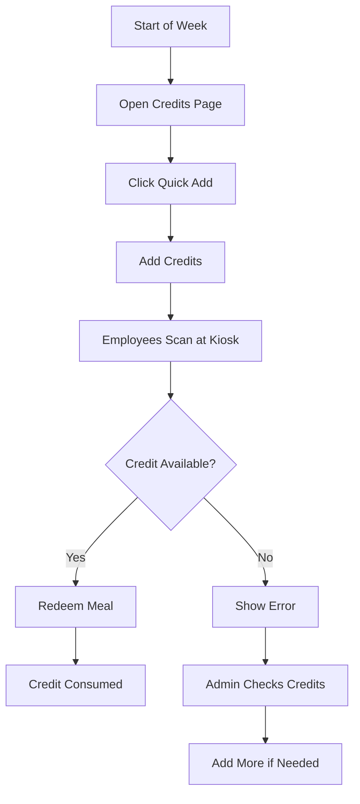

# 🎫 Credit Management System - User Guide

**Created:** 2026-02-05  
**Feature:** Add, view, and manage meal credits via web interface

---

## 🚀 **Quick Start**

### **Access Credit Management:**

1. **Open browser:** `http://localhost:3000/admin/credits`
2. **You'll see two panels:**
   - Left: Add credits form
   - Right: View current credits

---

## ✅ **How to Add Credits**

### **Method 1: Quick Add for All Employees** ⭐ **EASIEST**

1. Click **"All Employees + Next 7 Days"** button
2. This automatically:
   - Selects all employees ✅
   - Sets date range to next 7 days ✅
   - Sets 1 lunch + 1 OT meal per day ✅
3. Click **"Add Credits"**
4. Done! ✅

**Use this when:** Starting the week, all employees need credits

---

### **Method 2: Custom Selection**

1. **Select Employees:**
   - Check individual employees
   - Or click "Select All" / "Deselect All"

2. **Set Date Range:**
   - Start Date: `2026-02-05`
   - End Date: `2026-02-12` (7 days later)

3. **Set Credit Amounts:**
   - Lunch Credits: `1` (default)
   - OT Meal Credits: `1` (default)

4. **Click "Add Credits"**

**Use this when:** Only certain employees need credits, or custom date ranges

---

## 📊 **View Current Credits**

### **Right Panel: Current Credits Table**

- Shows all credits from selected date forward
- Filter by date using date picker
- Green numbers = credits available
- Gray numbers = credits used up

**Columns:**
- **Employee:** Name and PIN
- **Date:** Date of credit
- **Lunch:** Lunch credit count
- **OT:** OT meal credit count

---

## 💡 **Common Scenarios**

### **Scenario 1: Weekly Credit Addition**

**Every Monday morning:**
1. Go to Credits page
2. Click "All Employees + Next 7 Days"
3. Click "Add Credits"
4. Done! Everyone has credits for the week

---

### **Scenario 2: New Employee**

**Add a new employee:**
1. First, add employee in `/admin/employees`
2. Go to Credits page
3. Select only the new employee
4. Set date range (today → end of month)
5. Click "Add Credits"

---

### **Scenario 3: Extra Credits**

**Give someone extra credits:**
1. Select that employee only
2. Set today's date as start and end
3. Set Lunch Credits: `2` (instead of 1)
4. Click "Add Credits"

---

### **Scenario 4: Holiday/Weekend**

**Skip weekend credits:**
1. Add credits for Mon-Fri only
2. Don't add for Sat-Sun
3. Credits will only be available on work days

---

## 🔍 **Understanding the System**

### **How Credits Work:**

```
1. Credits are PRE-ALLOCATED
   - Must add credits BEFORE employees can redeem
   - Each day = separate credit entry

2. Credits are CONSUMED on redemption
   - Lunch credit: 1 → 0 (after lunch scan)
   - OT credit: 1 → 0 (after OT scan)

3. Credits are DATE-SPECIFIC
   - Feb 5 credits ≠ Feb 6 credits
   - Can't use tomorrow's credit today
```

### **Credit Lifecycle:**

```
Add Credits → Employee Scans → Credit Consumed → Can't Scan Again

Example:
Day 1: Lunch credit = 1
       ↓ (scan at 12:00 PM)
       Lunch credit = 0
       ↓ (try to scan again)
       Error: "No credit available" ✅ Correct!
```

---

## ⚠️ **Important Notes**

### **DO's:**
- ✅ Add credits at the start of each week
- ✅ Check current credits before adding more
- ✅ Use "upsert" feature (updates existing credits automatically)
- ✅ Filter by date to see only relevant credits

### **DON'Ts:**
- ❌ Don't add duplicate credits (system handles this)
- ❌ Don't forget weekends if employees work then
- ❌ Don't set credits to 0 (just don't add them)

---

## 🎯 **Best Practices**

### **Weekly Routine:**
```
Monday 9:00 AM:
1. Open /admin/credits
2. Click "All Employees + Next 7 Days"
3. Add Credits
4. Verify in table
5. Done!

Time: 30 seconds
```

### **Monthly Planning:**
```
First day of month:
1. Review employee list
2. Add credits for entire month
3. Or add weekly as needed
```

---

## 📱 **Mobile Access**

**Yes!** The credit management page is mobile-responsive:
- Access from tablet
- Access from phone
- Same features, optimized layout

---

## 🔐 **Security Note**

**Currently:** Anyone can access `/admin/credits`

**Future:** Will require admin login (Phase 2 enhancement)

**For now:** Keep the URL private, use only on admin PC

---

## 🆘 **Troubleshooting**

### **"No employees showing"**
→ Add employees first in `/admin/employees`

### **"API error when adding credits"**
→ Check database connection
→ Verify Supabase is accessible

### **"Credits not appearing in table"**
→ Change filter date
→ Refresh page

### **"Kiosk says 'No credit available'"**
→ Go to Credits page
→ Check if credits exist for today
→ Add credits if missing

---

## 📊 **Credit Management Workflow**



---

## ✅ **Success Checklist**

After adding credits, verify:
- [ ] Table shows new credits
- [ ] Correct employee names
- [ ] Correct date range
- [ ] Lunch and OT both = 1
- [ ] Test one scan at kiosk
- [ ] Scan succeeds ✅

---

## 🎊 **You're Ready!**

**Go to:** `http://localhost:3000/admin/credits`

**Click:** "All Employees + Next 7 Days"

**Done!** Your system is now ready for testing! 🎉

---

**Need help? Check ROADMAP.md for next steps!**
